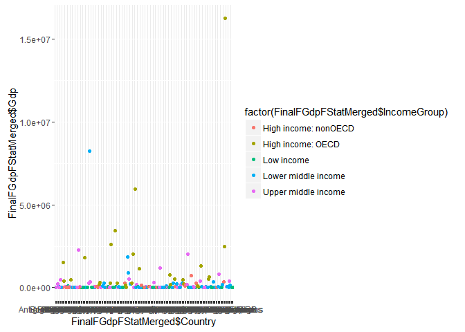

# Case Study Unit06
Salomon Gilles  
June 17, 2016  


```
## 
## Attaching package: 'dplyr'
```

```
## The following objects are masked from 'package:stats':
## 
##     filter, lag
```

```
## The following objects are masked from 'package:base':
## 
##     intersect, setdiff, setequal, union
```

```
## Loading required package: bitops
```

```
## Downloading data from: https://d396qusza40orc.cloudfront.net/getdata%2Fdata%2FGDP.csv
```

```
## SHA-1 hash of the downloaded data file is:
## 18dd2f9ca509a8ace7d8de3831a8f842124c533d
```

```
## Warning in fread(data, sep = sep, header = header, data.table = F,
## stringsAsFactors = stringsAsFactors, : Bumped column 6 to type character
## on data row 66, field contains 'a'. Coercing previously read values in this
## column from logical, integer or numeric back to character which may not
## be lossless; e.g., if '00' and '000' occurred before they will now be just
## '0', and there may be inconsistencies with treatment of ',,' and ',NA,' too
## (if they occurred in this column before the bump). If this matters please
## rerun and set 'colClasses' to 'character' for this column. Please note
## that column type detection uses the first 5 rows, the middle 5 rows and the
## last 5 rows, so hopefully this message should be very rare. If reporting to
## datatable-help, please rerun and include the output from verbose=TRUE.
```

```
## Downloading data from: https://d396qusza40orc.cloudfront.net/getdata%2Fdata%2FEDSTATS_Country.csv
```

```
## SHA-1 hash of the downloaded data file is:
## 20be6ae8245b5a565a815c18a615a83c34745e5e
```

## INTRODUCTION

This study is a report of the top 190 world economies for the year 2012 as reported by the World Bank. Data is provided for various economic indicators, but our focus is on the size of the country’s economy, i.e. its GDP which gives its ranking among the other countries, and the income level or group to which it belongs. We use various steps and tools to analyze the data and extract the necessary facts. Finally, it said a picture is worth a thousand words, so we use tables and graphs to give a vivid summary of our report.

## DATA ACQUISITION

The data we will be using for the study come from the World Bank. There are two files named getdataFdataFGDP.csv and getdataFdataFEDSTATS_Country.csv respectively. Both files are housed at the following URL: <https://d396qusza40orc.cloudfront.net>. One contains GDP data ranking information for the top 190 economies and the other contains matching income data for the same countries based on their GDP.

- Downloading:
    - in this phase we execute the code that actually pulls the two data files from the specified URL into our project
    - ##### Downloading FGDP and FSTAT data files from internet #####

- Tidying:  
    - In the tidy phase, we take a pick at the data to determine it's type/content, fields needed, also if it needs cleaning
      - we need only four fields from the GDP data structure: CountryCode, Ranking, Country and Gdp. Extract only those fields
      - for the FSTAT data, we need only the CountryCode and the IncomeGroup data fields
    - So  we extract the four fields in the GDP data into a data set
    - we also extract the two fields in the FSTAT data into a separate data set
    - after examining the data, we clean:
      - GDP field contains commas which make it unsuitable for math.
        - we remove all commas
        - convert the field to numeric type so we can do math 
        - we also adjust field names
      - The STAT data is good all we do is adjust the name field for IncomeGroup
      - clean all data for for computation and display as neeeded

- Merging:

    - Now that we have sorted out the issues, all we need to do is merge the data for analysis

## ANALYSIS
####1. The number of IDs matched by using the short country code is displayed below.####


```r
print(paste("The number of IDs matched by country code is ", as.numeric(dim(FGdpFStatMerged)[1])))
```

```
## [1] "The number of IDs matched by country code is  211"
```

```r
# count of missing/incomplete
```

####2. After sorting the dataset in ascending order, the following code displays the thirteenth country.####


```r
FinalMergedStorted <- FinalFGdpFStatMerged[order(FinalFGdpFStatMerged["Gdp"]),]
# get the 13th country from the sorted list
thirthCountry <- FinalMergedStorted[13,3]
print(paste("The thirteenth country after performing ascending sort is ", thirthCountry))
```

```
## [1] "The thirteenth country after performing ascending sort is  St. Kitts and Nevis"
```

####3. The number of IDs with NAs or missing some other data are ####


```r
print(paste("The number of missing NAs found are ", as.numeric(dim(FGDPSTATMissing)[1])))
```

```
## [1] "The number of missing NAs found are  22"
```

####4. The the average GDP rankings for the "High income: OECD" and "High income: nonOECD" groups respectively,  are:####


```r
# select subset of high income : oecd countries and nonoecd countries
HighOECD <- subset(FinalFGdpFStatMerged, FinalFGdpFStatMerged[5] == "High income: OECD")
HighOECD <- mean(HighOECD[,"Gdp"])
print(paste("The average GDP for High income OECD countries is ", HighOECD))
```

```
## [1] "The average GDP for High income OECD countries is  1483917.13333333"
```

```r
HighnonOECD <- subset(FinalFGdpFStatMerged, FinalFGdpFStatMerged[5] == "High income: nonOECD")
HighnonOECD <- mean(HighnonOECD[,"Gdp"])
print(paste("The average GDP for High income nonOECD countries is ", HighnonOECD))
```

```
## [1] "The average GDP for High income nonOECD countries is  104349.826086957"
```

####5. Country GDP plotted color-coded using ggplot2 with five distinct colors representng the five income groups####


```r
ggplot(FinalFGdpFStatMerged, aes(FinalFGdpFStatMerged$Country, FinalFGdpFStatMerged$Gdp, color=factor(FinalFGdpFStatMerged$IncomeGroup))) + geom_point()
```

<!-- -->

####6. The summary of total GDP in terms of income per quartile.####


```r
FinalQuants <- quantile(FinalFGdpFStatMerged[,"Gdp"])
summary(FinalQuants)
```

```
##     Min.  1st Qu.   Median     Mean  3rd Qu.     Max. 
##       40     6972    28240  3297000   205800 16240000
```

```r
# rearrange from max to min
quantilData <- matrix(c(FinalQuants[1],FinalQuants[2],FinalQuants[3],FinalQuants[4],FinalQuants[5]), ncol = 1, byrow = TRUE)
mytable <- data.frame( quartilData = quantilData)
summary(mytable)
```

```
##   quartilData      
##  Min.   :      40  
##  1st Qu.:    6972  
##  Median :   28242  
##  Mean   : 3297129  
##  3rd Qu.:  205789  
##  Max.   :16244600
```

####7. About 5 of the top 38 GDPs fall within lower middle income ####

Having a large GDP does not necessarily translate into high income. We have reviewed the economies of the top 38 GDPs but a handful of them fall in the lower middle income category.


```r
SortedHigh2Low <- FinalFGdpFStatMerged[order(-FinalFGdpFStatMerged["Gdp"]),]
# select top 38
top38High2Low <- SortedHigh2Low[1:38,]
# count of lower middle income countries within highest gdp
LMIwithHighGdpCount <- subset(top38High2Low, top38High2Low["IncomeGroup"] == "Lower middle income")
print(LMIwithHighGdpCount)
```

```
##     CountryCode Ranking          Country     Gdp         IncomeGroup
## 37          CHN       2            China 8227103 Lower middle income
## 87          IND      10            India 1841710 Lower middle income
## 85          IDN      16        Indonesia  878043 Lower middle income
## 185         THA      31         Thailand  365966 Lower middle income
## 56          EGY      38 Egypt, Arab Rep.  262832 Lower middle income
```

```r
print(paste("The number of countries among top 38 ranking GDP with lower middle income are ", as.numeric(dim(LMIwithHighGdpCount)[1])))
```

```
## [1] "The number of countries among top 38 ranking GDP with lower middle income are  5"
```

## CONCLUSION
We have analyzed the World Bank GDP and income statistical data for 2012. The US GDP by far surpasses that of most countries, followed by the economies of several western countries, Japan and China. Our analysis also looks at the world economy through five income groups and uses graphs to paint a clear picture. This report could serve as a great tool for strategic planning and investment.

However, one last point to note is that even though the gross domestic product of a some countries is really high, it does not directly translate to high income for its citizens.

